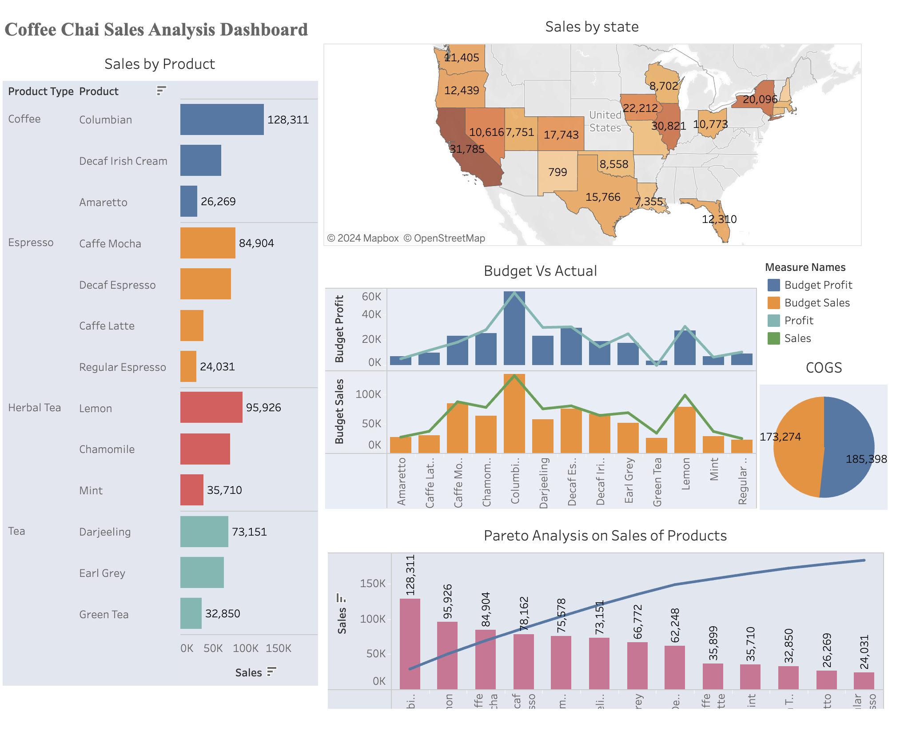

# Coffee-Shop-Sales-Dashboard-
Interactive Sales dashboard of a Coffee shop 

# Tableau Dashboard
Click [Link](https://us-east-1.online.tableau.com/#/site/skndula2f1659862fe/views/Cofeechai_tableau_CXOdashboard/SalesdashboardforCXO?:iid=4) to view the interactive dashboard

# Executive Summary
1. Top Performing Product:

* Columbian Coffee: Achieved the highest sales of $128K, generating a profit of $55K. Additionally, the budget profit for this product is $57K.
2. Top Performing Regions:

* California: Led with the highest profit of $31,795.
* Illinois: Followed closely with a profit of $30,821.
* Time Frame: These figures pertain to the period between 2010 and 2011.
3. Pareto Analysis Insights:

* Implemented a Pareto analysis to identify the key products driving sales.
* Columbian Coffee and Lemon Tea: These products fall within the top 20% of the offerings and contribute to the highest sales.
4. Cost of Goods Sold (COGS):

* Major Market: Incurred the highest cost of goods sold at $185,398.
* Small Market: Incurred a COGS of $173,274.

